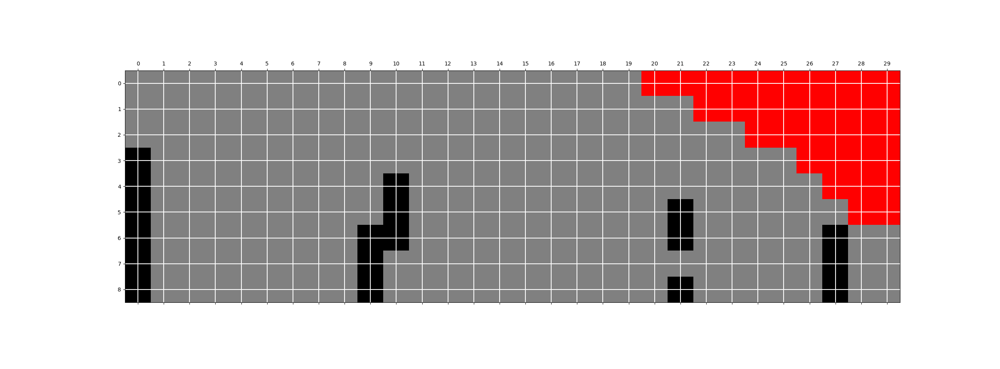

# carSim
carSim is a simulator for toll lanes traffic.

`pythonw main.py` to run it

`main.py` is the entry

`controller/viz.py` provides a matplotlib solution for visualization/animation of the grid

`controller/tick.py` is the logic core, which controls the cars each `tick()` round

`model/dt.py` is the main data structure, a 2d grid, which holds `Tile`

`model/tile.py` is the `Tile` class represented in the 2d grid, `Tile`(grey) can be disabled(red), or holds a car(black)

`model/car.py` is the core to operate the cars, `Car.p` is the probability to changeLane()

## Example image
